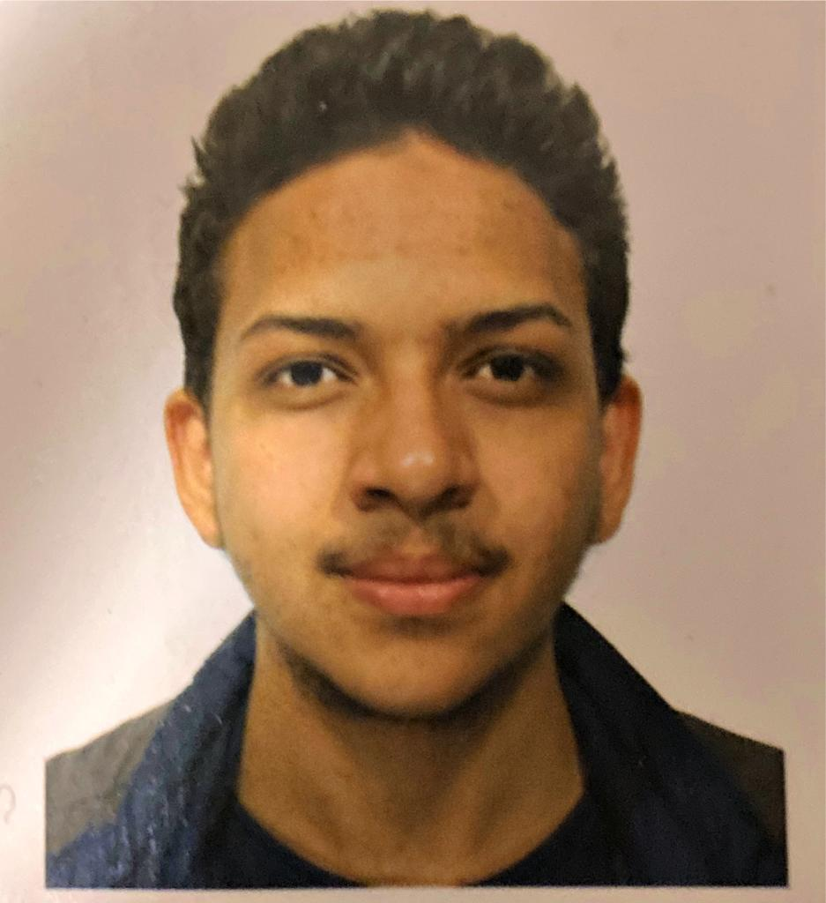

# Marawan Emad
### Contatti:
#### Email: marawanemad09@gmail.com
#### Cellulare: 3928468041

**FORMAZIONE:**
* _2021_: Diploma di maturità in informatica e telecomunicazione
* _2021_-in corso: Laurea triennale in tecnologie dei sistemi informatici presso università di Bologna (campus di Cesena)

Patente B conseguita a giugno 2021

**COMPETENZE:**
* Lingua Araba - *Madrelingua*
* Lingua Inglese - *B2*
* HTML, CSS, JavaScript, TypeScript, NuxtJs - *livello intermedio*
* Python - *livello intermedio*
* Linguaggio C - *livello intermedio*
* SQL, DataBase Development - *livello intermedio*

**CERTIFICAZIONI:**
* CISCO: CCNAv7: Introduction to Networks
* CISCO: IT Essentials: PC Hardware and Software

**TIROCINIO:**
* Tecnico software presso azienda di sicurezza informatica "Cotini S.r.L"
